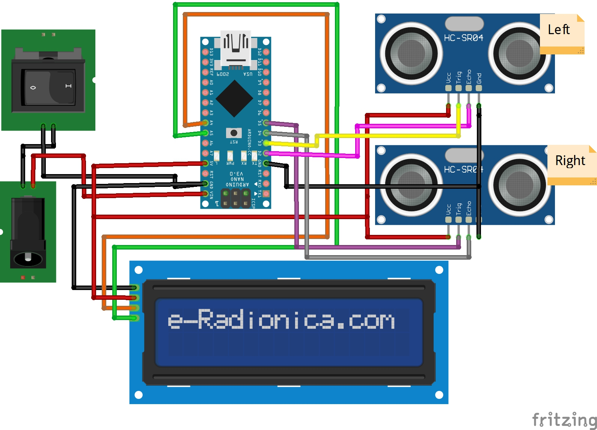

# Attendance System using Ultrasonic Sensor

This project is an attendance system that utilizes ultrasonic sensors to detect the presence of individuals in a seating area. The system provides real-time updates on the number of available and occupied seats, using an LCD screen, LED lights, and a buzzer for notifications.

## Table of Contents

- [Installation](#installation)
- [Usage](#usage)
- [Features](#features)
- [Configuration](#configuration)
- [Acknowledgments](#acknowledgments)
- [Contributing](#contributing)
- [License](#license)
- [Contact](#contact)

## Installation

To get started with the attendance system using the ultrasonic sensor, follow these steps:

1. Assemble the hardware components according to the circuit:


2. Components:
	- 1 * Arduino Nano
	- 2 * Ultrasonic Sensor
	- 1 * LCD 16*2
	- 1 * I2C Module for LCD 16*2
	- 1 * Power Jack
	- 1 * Switch

3. Clone or Download the repository to your local machine using the following command:
```
git clone https://github.com/kershrita/Attending-System-using-Ultrasonic.git
```
4. Connect the Arduino board to your computer using a USB cable.
5. Open the Arduino IDE and create a new sketch and copy and paste the provided code into the Arduino IDE.
6. Make sure the Arduino board is selected under the Tools menu and the necessary libraries are installed:
- Go to **Sketch** -> **Include Library** -> **Manage Libraries**.
- Search for and install the following libraries:
    - `Wire`
    - `LiquidCrystal_I2C`
    - `Ultrasonic`
7. Click the Upload button to upload the code to the Arduino board.

## Usage

1. Once the code is uploaded, open the serial monitor to view the measured distances from the ultrasonic sensors.
2. Place the ultrasonic sensors and the device in the desired location.
3. Observe the LCD screen, LED lights, and buzzer for notifications on seat availability and occupancy.
4. You can adjust the **threshold** value in the code to fine-tune the sensitivity of the ultrasonic sensors.

**Note**: 
- Place the device against a wall or any other flat surface, leaving a distance of at least **70 cm** between the device and the wall. This will help ensure accurate readings from the ultrasonic sensor.
- Place the two ultrasonic sensors at least **35 cm** apart.

## Features

- **Real-time Seat Status** : The attendance system continuously monitors the presence of individuals in the seating area and provides real-time updates on the number of available and occupied seats.
- **LCD Display** : The system incorporates an LCD screen to display the current count of busy and free chairs, allowing users to quickly and easily assess the availability of seats.
- **Adjustable Sensitivity**: The code allows for adjusting the sensitivity of the ultrasonic sensors by modifying the threshold value. This flexibility enables customization to suit different seating arrangements and environments.
- **Buzzer Alerts**: A buzzer is integrated into the system to provide audio alerts when a seat becomes available or occupied. The buzzer emits a sound to attract attention and notify users of the seat status change.

## Acknowledgments

We would like to acknowledge the following resources and libraries that have been instrumental in developing Robot Car using DTMF Module:

- **[Arduino IDE](https://www.arduino.cc/en/software)**:  An open-source integrated development environment (IDE) used for programming Arduino boards.


## Contributing

Contributions to the attendance system using the ultrasonic sensor are welcome. If you have any ideas for improvements or new features, feel free to open an issue or submit a pull request. Please follow the contribution guidelines specified in the repository.

## License

Attendance System using Ultrasonic Sensor is released under the [MIT License](LICENSE).

## Contact

- Mail: ashrafabdulkhaliq80@gmail.com
- LinkedIn: https://www.linkedin.com/in/ashraf-abdulkhaliq
- GitHub: https://github.com/kershrita